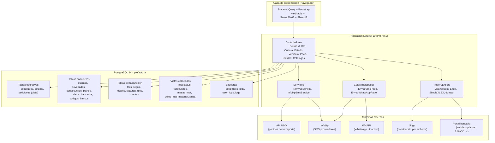
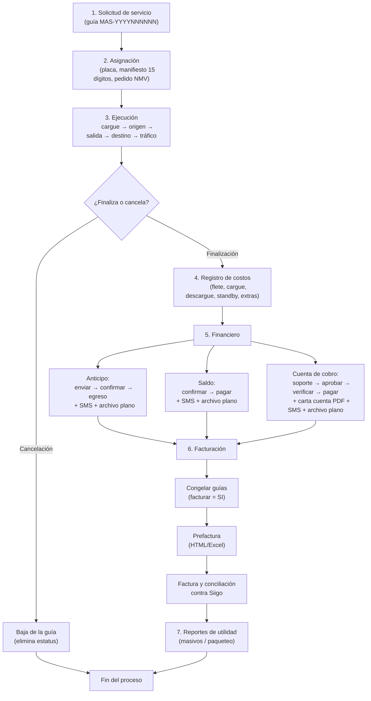
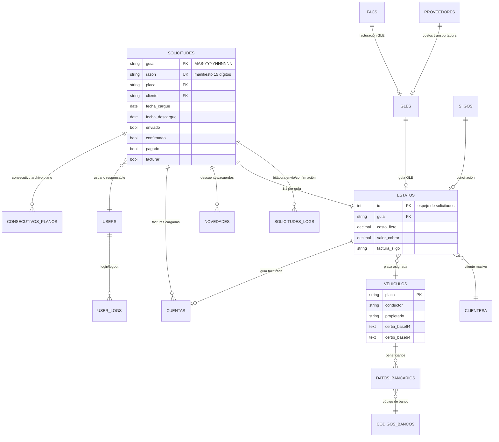

# Documentación del Sistema de Gestión de Servicios de Transporte de Carga Masiva

**Sistema:** Prefactura — Gestión de servicios masivos de transporte de carga
**Empresa:** GRUPO LOGISTICO ESPECIALIZADO SAS (GLE Colombia SAS) — NIT 900.614.022-2
**Tipo de desarrollo:** Aplicación a medida (web)
**Plataforma:** Laravel 10 / PHP 8.1 / PostgreSQL 14 / Bootstrap + jQuery
**Última actualización:** 2026-08-28
**Autor:** Equipo de desarrollo GLE Colombia

---

## 1. Descripción detallada de la necesidad del negocio

GLE Colombia SAS es una empresa de logística y transporte de carga que opera **servicios masivos** (transporte de carga por volúmenes altos, típicamente por encima de 33 toneladas) y **paqueteo** para clientes corporativos del sector automotriz (DERCO, INCHCAPE, METROKIA, SIMONIZ, DISTRIBUIDORA TOYOTA, entre otros) y otros sectores industriales.

Antes de la implementación de este sistema, la operación presentaba las siguientes problemáticas:

1. **Gestión manual y dispersa de la operación de transporte.** La trazabilidad de cada solicitud de servicio (asignación de vehículo, eventos de cargue, origen, salida, destino y finalización) se llevaba en hojas de cálculo y correos electrónicos, lo que generaba pérdida de información, errores humanos y falta de control en tiempo real.

2. **Falta de control financiero sobre los anticipos y saldos a transportadores.** La tesorería pagaba anticipos, saldos y cuentas de cobro a los conductores y proveedores sin un flujo formal de aprobación, verificación y pago. Esto derivaba en pagos duplicados, pagos sin soporte y saldos sin conciliar.

3. **Carga de datos repetitiva y propensa a errores.** Los datos de guías, manifiestos, costos y facturas provenían de los sistemas de los clientes y de la transportadora en archivos de Excel y CSV. Su digitación manual implicaba tiempos prolongados y altas tasas de error.

4. **Inexistencia de un proceso de prefacturación y facturación controlado.** La facturación a clientes y la conciliación con el ERP contable **Siigo** se realizaba de forma desordenada, sin congelamiento de información, sin trazabilidad de las guías facturadas y sin reportes de utilidad confiables.

5. **Pagos a proveedores sin canal bancario estructurado.** Los pagos se gestionaban de forma individual y manual. La entidad bancaria exige **archivos planos (BANCO.txt)** con formato de ancho fijo para procesar pagos masivos; su generación manual consumía horas de trabajo y estaba sujeta a errores de formato que rechazaban los lotes.

6. **Falta de comunicación oportuna con los proveedores.** Los transportadores no recibían confirmación de sus pagos de manera formal; la empresa necesitaba notificar por SMS la confirmación, el desglose y el pago de anticipos, saldos y cuentas de cobro.

7. **Flota de vehículos sin control de requisitos.** La operación debe garantizar que los vehículos que prestan servicio cumplan requisitos de seguridad, documentación (SOAT, tecnomecánica, SIMUR, SIMIT, ICA) y **certificación bancaria** para poder ser pagados. El control se hacía en papel.

**Solución implementada:** se desarrolló un sistema web a medida que centraliza el ciclo de vida completo del servicio masivo — desde la solicitud y la asignación de vehículo hasta la facturación y el pago al proveedor — con carga masiva de archivos, generación automática de archivos planos bancarios, notificación por SMS, control de flota y reportes de utilidad.

---

## 2. Descripción corta

Sistema web a medida para la gestión integral de servicios de transporte de carga masiva de GLE Colombia SAS. Cubre el ciclo completo del servicio: solicitud, asignación de vehículo, eventos operativos (cargue, origen, salida, destino, finalización), control financiero de anticipos, saldos y cuentas de cobro a transportadores, generación de archivos planos bancarios (BANCO.txt), notificaciones por SMS, gestión de flota vehicular con certificación bancaria, prefacturación, facturación con conciliación contra el ERP Siigo y reportes de utilidad.

---

## 3. Entradas

### 3.1 Información capturada por formularios web

| Entrada | Descripción | Módulo |
|---|---|---|
| Solicitud de servicio | Fechas/horas de cargue y descargue, regional, cliente, origen/destino, ejecutivo, tipo de vehículo, carrocería, trayecto, documento del cliente, destinatario, dirección, piezas, peso, valor declarado | Operaciones |
| Registro de vehículos | Placa, conductor, propietario, tipo de vehículo, requisitos (GPS, SOAT, tecnomecánica, SIMUR, SIMIT, ICA), compraventa y **certificados bancarios** (PDF/PNG/JPG ≤ 2 MB, almacenados en base64) | Flota |
| Clientes y catálogos | Clientes masivos (NIT), clientes tradicionales, proveedores/transportadoras, códigos de bancos, datos bancarios, centros de costo, cotizaciones y precios | Administración |
| Edición inline de eventos | Actualización de costos, eventos del ciclo de vida, anticipos, egresos, listado pre-operacional (LPO), congelación para facturación | Operaciones/Financiero |

### 3.2 Carga masiva de archivos (Excel/CSV)

| Archivo | Contenido esperado | Proceso de destino |
|---|---|---|
| Excel XLSX de guías | `ID solicitud, guía, destino real, documento cliente, destinatario, dirección, piezas, peso, valor declarado` (solo 9 clientes autorizados) | Tabla `estatus` |
| Excel XLSX de manifiestos | `manifiesto (15 dígitos), recibido_cumplido, fecha_envio` | Tabla `solicitudes` (plantilla `SUBIR_MANIFIESTOS.xlsx`) |
| Excel XLSX de registros Siigo | `guía, factura_siigo, fecha_siigo` | Tabla `estatus` |
| Excel XLSX de ítems/costos | `guía, dcf, dts, dcyd, dpaux, dpsby, dpmtc, dpesc, dpcas, dpmon, dpesg, dst, egreso_anticipo, egreso_saldo, fecha_saldo` | Tabla `estatus` |
| Excel XLSX de congelamiento | `manifiesto, nota` (congelar/descongelar pagos) | Tabla `novedades` |
| Excel XLSX de facturas | `guía, valor, factura` | Tabla `cuentas` |
| Excel XLSX de guías GLE | `guía, total, factura` | Tabla `facs` |
| Excel XLSX de facturas Siigo | `factura, fecha_siigo, valor_siigo` | Tabla `siigos` |
| CSV/TXT de guías GLE | `guía;operador;cliente;fecha;origen;destino;declarado;piezas;trayecto;kilo;total;factura` | Tabla `gles` (LOAD DATA INFILE) |
| CSV/TXT de proveedores | `guía;transportadora;origen;destino;fecha;documento;remitente;destinatario;trayecto;servicio;declarado;piezas;pesos;valores;cliente` | Tabla `proveedores` (LOAD DATA INFILE) |
| Imagen/PDF de soportes | Soportes de cuentas de cobro (jpg/png/pdf → base64) | Tabla de cuentas (vía AJAX) |

### 3.3 Integraciones externas consumidas

| Integración | Uso | Datos de entrada |
|---|---|---|
| API NMV (`testmasivo.nmv.app`) | Creación automática de solicitudes de transporte (`enviarPedidoAuto`) | Login usuario/clave, payload JSON con datos de la solicitud |
| Infobip (SMS) | Notificaciones de pagos a proveedores | Número de teléfono y mensaje estructurado |
| WHAPI (WhatsApp) | Job de mensajería (disponible, no activo) | Número y mensaje |

---

## 4. Salidas

### 4.1 Archivos planos bancarios (pago masivo a proveedores)

Tres tipos de archivo `BANCO.txt` de **ancho fijo de 264 caracteres por registro**, listos para cargar en el portal bancario:

| Archivo | Concepto | Contenido |
|---|---|---|
| Anticipos | `MAyymmddNN` | Pagos de anticipos a transportadores (`valor_a_pagar`) |
| Saldos | `MSyymmddNN` | Pagos de saldos finales de servicios |
| Cuentas | `MCyymmddNN` | Cuentas de cobro con retención calculada (RETEICA 0,414% e IVA a 1%) |

Estructura: línea de cabecera tipo `1` (NIT pagador 900614022, cuenta débito 0018000042893, total del lote) y líneas de detalle tipo `6` (documento del beneficiario, nombre, código de banco, número de cuenta, tipo de transacción 27=corriente/37=ahorro, valor, fecha). El consecutivo diario se controla en la tabla `consecutivos_planos`.

### 4.2 Exportaciones Excel/CSV (19 reportes)

| Reporte | Contenido |
|---|---|
| `diario.xlsx` / `diarias.xlsx` | Anticipos enviados sin confirmar / registros activos |
| `estatus_YYYY_MM.xlsx` | Estatus financiero completo por guía (costos, valores, utilidad) |
| `prefactura_YYYY_MM.xlsx` / `prefactura_completa_*.xlsx` | Prefacturas congeladas (resumen y detalle de costos) |
| `historicos_*.xlsx` | Servicios finalizados/cancelados |
| `utilidad_masivos_mes_*.xlsx` / `paqueteo_mes_*.xlsx` | Utilidad por cliente (masivos y paqueteo) |
| `facturacion.xlsx` / `reporte_facturas_*.xlsx` | Conciliación GLE y comparativo contra Siigo |
| `cargues_factura_YYYY_MM.xlsx` / `cuentas_pendientes.csv` / `historico_cuentas.xlsx` | Gestión de cuentas de cobro |
| `vehiculos.xlsx`, `cotizaciones_*.xlsx`, `reporte.xlsx`, `logs_mes_*.xlsx`, `registros_trafico.xlsx`, `anticipos_*.csv` | Flota, cotizaciones, reportes financieros, bitácoras y tráfico |

### 4.3 Documentos imprimibles

| Documento | Formato | Descripción |
|---|---|---|
| Carta cuenta | PDF (dompdf) | "DEBE A:" con valor bruto, retenciones y valor neto por guía; descarga individual o empaquetado en ZIP |
| Prefactura | HTML imprimible + Excel | Vista de prefacturación por guías seleccionadas (exportable con SheetJS) |
| Factura | HTML imprimible | Facturación con división de valores entre remesas/radicados |

### 4.4 Notificaciones

| Tipo | Destino | Evento |
|---|---|---|
| SMS (Infobip) | Proveedor (teléfono registrado) | Confirmación de anticipo (resumen: reteica, retefuente, seguro, valor pagado), pago de saldo (desglose completo) y pago de cuenta de cobro |
| SMS (Infobip) | Administración (números fijos) | Creación de vehículo con certificado bancario |
| SMS (Infobip) | Magaly (contabilidad) | Cargue de soporte de cuenta de cobro |
| WhatsApp (WHAPI) | Proveedores | Job disponible para mensajería (no activo) |

### 4.5 API y respuestas AJAX

- Creación de solicitudes de transporte en la API externa NMV con retorno del número de pedido.
- Respuestas JSON para edición inline (x-editable), validaciones (422 con errores), consultas de vehículos y reportes dinámicos.

---

## 5. Detalle del requerimiento

### 5.1 Alcance funcional (módulos)

1. **Operaciones (masivos):** solicitudes de servicio con guía secuencial `MAS-YYYYNNNNNN`, asignación de vehículo y manifiesto (15 dígitos, único), eventos cronológicos validados (cargue → llegada a origen → salida → llegada a destino → tráfico → finalización o cancelación), listado pre-operacional (LPO) y envío opcional de pedido a la API NMV.

2. **Financiero / Tesorería:** control de anticipos (envío, confirmación, egresos), saldos (confirmación, pago), cuentas de cobro con flujo de estados **PENDIENTE POR APROBAR → PENDIENTE POR VALIDAR → PENDIENTE POR PAGAR → CUENTA PAGADA**, fecha tentativa de pago (cumplido + 9 días hábiles con calendario de festivos), novedades (descuentos, penalizaciones, congelamientos) y **acuerdos de pago** fraccionados en hasta 3 cuotas descontadas de saldos de la misma placa.

3. **Facturación:** congelamiento de guías facturables (`facturar=SI`), generación de prefacturas y facturas, división de valores entre remesas/radicados, cargue de facturas y conciliación contra Siigo.

4. **Flota vehicular:** registro de vehículos con certificados bancarios en base64, estados calculados automáticamente (ACTIVO/INACTIVO/DESACTIVADO/NO CUMPLE) según requisitos de seguridad y vigencia de evaluación, flujo de creación contable del transportador y datos bancarios por beneficiario.

5. **Reportes:** utilidad de masivos y paqueteo (vistas materializadas `masas_mat`/`utiles_mat` con refresco concurrente), reportes por operador GLE, estatus financiero, históricos y bitácoras.

### 5.2 Requisitos funcionales (RF)

| ID | Requisito |
|---|---|
| RF-01 | El sistema debe permitir registrar solicitudes de servicio de transporte de carga masiva con generación de guía secuencial. |
| RF-02 | El sistema debe permitir cargar guías, manifiestos, costos, facturas y registros Siigo de forma masiva mediante archivos Excel/CSV, reportando errores por fila sin detener el proceso. |
| RF-03 | El sistema debe controlar el ciclo de vida del servicio mediante eventos con validación de orden cronológico y registro del usuario responsable. |
| RF-04 | El sistema debe gestionar anticipos, saldos y cuentas de cobro a transportadores con flujos de aprobación, verificación y pago, y bloqueo de servicios por novedades o acuerdos de pago. |
| RF-05 | El sistema debe generar archivos planos bancarios de ancho fijo (264 caracteres) para anticipos, saldos y cuentas, con consecutivo diario controlado. |
| RF-06 | El sistema debe notificar por SMS a los proveedores la confirmación y el pago de anticipos, saldos y cuentas de cobro. |
| RF-07 | El sistema debe permitir congelar guías para facturación y generar prefacturas y facturas (PDF, HTML imprimible y Excel). |
| RF-08 | El sistema debe soportar la conciliación de facturación contra el ERP Siigo mediante archivos y reportes comparativos. |
| RF-09 | El sistema debe administrar la flota vehicular con certificados bancarios y estados calculados según requisitos de seguridad. |
| RF-10 | El sistema debe generar reportes de utilidad por cliente, período y tipo de servicio (masivos/paqueteo). |
| RF-11 | El sistema debe autenticar usuarios con roles y permisos por módulo (anticipos, bancos, clientes masivos, acuerdos, verificación, utilidad, etc.). |

### 5.3 Reglas de negocio relevantes

- El manifiesto (`razon`) debe ser un número de **exactamente 15 dígitos** y no puede repetirse, salvo modalidad CRÉDITO.
- La carga de guías por Excel solo está permitida para 9 clientes autorizados; las guías existentes en `estatus` se omiten.
- Regla especial CPA DISTRIBUCIONES: valor declarado = peso × 58/63 según destino Bogotá.
- Los retiros de anticipo/saldo exigen datos del receptor válidos (pagar a, cuenta, teléfono) y dejan trazabilidad en `solicitudes_logs`.
- Retenciones sobre cuentas de cobro: RETEICA 0,414% (si aplica ICA) y RETEFUENTE 1% sobre cargue1 + cargue2 + standby + desplazamiento.
- La finalización del servicio exige remesa, radicado, manifiesto, nota de cumplido y condición de pago; los servicios con pago anticipado requieren anticipo confirmado.
- Un vehículo solo es pagable si está ACTIVO y tiene certificación bancaria registrada.

### 5.4 Alcance técnico

- **Arquitectura:** aplicación web monolítica Laravel 10 (Blade + jQuery + Bootstrap + x-editable), autenticación Jetstream (2FA), roles con Spatie Permission, cola de base de datos para envío masivo de SMS.
- **Base de datos:** PostgreSQL 14; tablas operativas legadas (`solicitudes`, `estatus`, `peticiones`) sin migración, complementadas con vistas (`infoestatus`, `vehiculares`, `peticiones`) y vistas materializadas de utilidad (`masas_mat`, `utiles_mat`).
- **Integraciones:** API NMV (solicitudes), Infobip (SMS), WHAPI (WhatsApp, inactivo), Siigo (conciliación por archivos), portal bancario (archivos planos).
- **Procesamiento:** las cargas masivas y exportaciones se ejecutan de forma síncrona; solo las notificaciones SMS son asíncronas (colas).

### 5.5 Casos de uso principales

| Caso de uso | Actor | Flujo resumido |
|---|---|---|
| Registrar y ejecutar servicio | Operaciones | Crear solicitud → asignar placa/manifiesto → registrar eventos → finalizar/cancelar |
| Pagar anticipo | Tesorería | Enviar anticipo → confirmar (masivo) → registrar egreso → generar archivo plano → SMS |
| Pagar saldo | Tesorería | Confirmar saldos → pagar → archivo plano → SMS con desglose |
| Pagar cuenta de cobro | Tesorería | Cargar soporte → aprobar → verificar → pagar → carta cuenta PDF → archivo plano |
| Congelar y facturar | Facturación | Congelar guías → generar prefactura → facturar → conciliar Siigo |
| Registrar vehículo | Flota | Crear vehículo + certificados → SMS aviso → estado calculado ACTIVO |

---

## 6. Registro de errores

El sistema cuenta con varios niveles de registro de errores y trazabilidad:

### 6.1 Logs de aplicación (Laravel)

- Todos los controladores, jobs y servicios registran eventos y excepciones con `Log::error`, `Log::info` y `Log::warning` (canal *stack* → `storage/logs/laravel.log`).
- Los formularios AJAX capturan respuestas de error 422 (validación) y 500 (servidor) y las presentan al usuario mediante SweetAlert.

### 6.2 Errores de carga masiva de archivos

- La carga de guías (`procesarArchivos`) acumula `$errores[]` por fila y continúa procesando el resto del archivo; al final se reporta el detalle completo (archivo, fila, causa) al usuario.
- La importación de cuentas (`CuentasImport`) valida fila a fila y genera mensajes descriptivos en español (nuevos, actualizados, duplicados).
- El cargue CSV por `LOAD DATA INFILE` detecta guías duplicadas y reporta la guía exacta del conflicto.

### 6.3 Bitácoras de base de datos

| Tabla | Evento registrado | Contenido |
|---|---|---|
| `solicitudes_logs` | Envío y confirmación de anticipos | solicitud, usuario, campo modificado, valor anterior/nuevo, razón, IP y user-agent |
| `user_logs` | Inicio/cierre de sesión | usuario, evento, IP, user-agent |
| `logs` | Bitácora general de la operación | usuario, manifiesto, evento, fecha (alimentada por triggers del motor de BD) |

### 6.4 Control de errores de integraciones

- **API NMV:** reintento automático ante respuesta 401 (token vencido) con renovación de credenciales; los fallos se registran en el log de Laravel.
- **SMS (Infobip):** el job `EnviarSmsPago` tiene 3 reintentos, timeout de 600 s, pausa de 3 s entre mensajes y log individual por mensaje (éxito/fallo).
- **Archivos planos:** validación de consistencia del lote (cantidad de registros y suma total contra la cabecera) y control de duplicados del consecutivo diario mediante bloqueo de fila (`lockForUpdate`).

### 6.5 Prevención de inconsistencias

- Índices únicos parciales en PostgreSQL para impedir guías duplicadas nuevas en `solicitudes` y `estatus`.
- Transacciones de base de datos en los procesos de carga CSV y en el cálculo de consecutivos.
- Refresco concurrente de vistas materializadas de utilidad para evitar bloqueos de lectura.

---

## 7. Adjuntos — Diagramas

### 7.1 Diagrama de arquitectura del sistema

### 7.2 Diagrama del proceso de negocio (ciclo del servicio masivo)

### 7.3 Diagrama entidad-relación (núcleo del sistema)

---

### Glosario de términos

| Término | Significado |
|---|---|
| Guía | Identificador único del servicio de transporte (`MAS-YYYYNNNNNN`) |
| Manifiesto | Documento de viaje del transportador (15 dígitos) |
| Prefactura | Conjunto de guías congeladas (`facturar=SI`) listas para facturar |
| Archivo plano | `BANCO.txt` de ancho fijo (264 caracteres) para pagos bancarios masivos |
| Novedad | Descuento, penalización, congelamiento o acuerdo de pago aplicado a un manifiesto |
| LPO | Listado pre-operacional (preinspección del vehículo asignado) |
| PCD | Pago por cuenta de conductores/propietarios según beneficiario (PAGAR A) |
| Siigo | ERP contable con el que se concilia la facturación |
| NMV | Plataforma externa a la que se envían solicitudes de transporte automáticamente |
| Vistas materializadas | Vistas físicas de BD que aceleran los reportes de utilidad (`masas_mat`, `utiles_mat`) |
